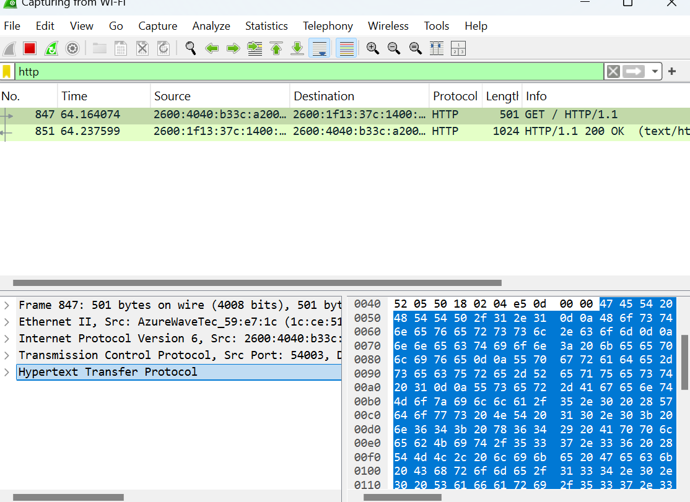

# 🌐 Wireshark Lab 2: HTTP Traffic Analysis

**Date:** April 2025  
**Tool Used:** Wireshark  
**Focus:** Capturing and analyzing basic HTTP traffic

---

## 🧪 Objective

Observe an unencrypted HTTP request and response to understand how browsers communicate with web servers.

---

## 🛠️ Lab Steps

1. Started a live capture on my Wi-Fi interface in Wireshark  
2. Visited [http://neverssl.com](http://neverssl.com) in my browser  
3. Filtered using `http`  
4. Identified the `GET` request and `200 OK` response  
5. Captured a screenshot showing visible payload data

---

## 🔍 What I Captured

- A successful `GET /` HTTP request using version 1.1  
- Response: `200 OK (text/html)` from the server  
- Protocol: HTTP over TCP  
- Full payload and metadata viewable in cleartext  

---

## 🖼️ Screenshot

---

## 💡 What I Learned

- HTTP traffic is **readable and vulnerable** without encryption  
- Sensitive data can be exposed if HTTPS isn't used  
- This reinforced why HTTPS and TLS are critical for secure browsing  
- Understanding the structure of web traffic helps in phishing detection, malware analysis, and SOC triage

---

## 🔜 Next Steps

- Capture a TCP handshake  
- Try capturing an HTTPS session (to compare encryption)
- Begin documenting phishing/emulated attack traffic in future labs

- 
