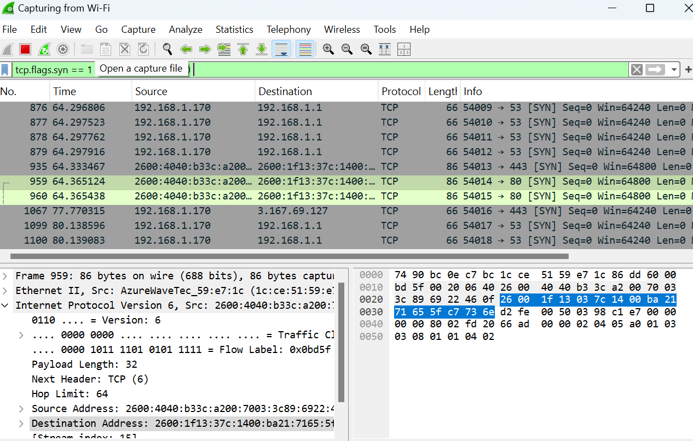

# 🤝 Wireshark Lab 3: TCP Handshake Analysis

**Date:** April 2025  
**Tool Used:** Wireshark  
**Focus:** Observing the 3-step TCP handshake used to establish network connections

---

## 🧪 Objective

Capture and understand the TCP 3-way handshake: SYN → SYN-ACK → ACK. This process is the foundation of most reliable network communication.

---

## 🛠️ Lab Steps

1. Started a live capture on my Wi-Fi interface  
2. Opened a browser and visited a webpage to trigger traffic  
3. Filtered with `tcp.flags.syn == 1` to isolate SYN packets  
4. Located SYN packets and viewed connection attempts  
5. Captured a screenshot of one TCP SYN initiating a connection to port 80 (HTTP)

---

## 🔍 What I Captured

- Multiple **SYN** packets initiating TCP connections  
- Example: Source port 54014 → Destination port 80  
- Flag: `SYN` set (start of handshake)  
- Protocol: TCP  
- No payload (just control info)

---

## 🖼️ Screenshot

---

## 💡 What I Learned

- TCP uses a **3-way handshake** (SYN → SYN-ACK → ACK) before any real data is exchanged  
- Each side negotiates sequence numbers and connection parameters  
- Recognizing this handshake helps in **detecting scans, abnormal flows, and connection anomalies**  
- This is foundational to **network analysis and intrusion detection**

---

## 🔜 Next Steps

- Capture full SYN → SYN-ACK → ACK sequence  
- Try analyzing a TCP Reset (RST) or abnormal termination  
- Explore other protocols built on top of TCP (like TLS/HTTPS)
